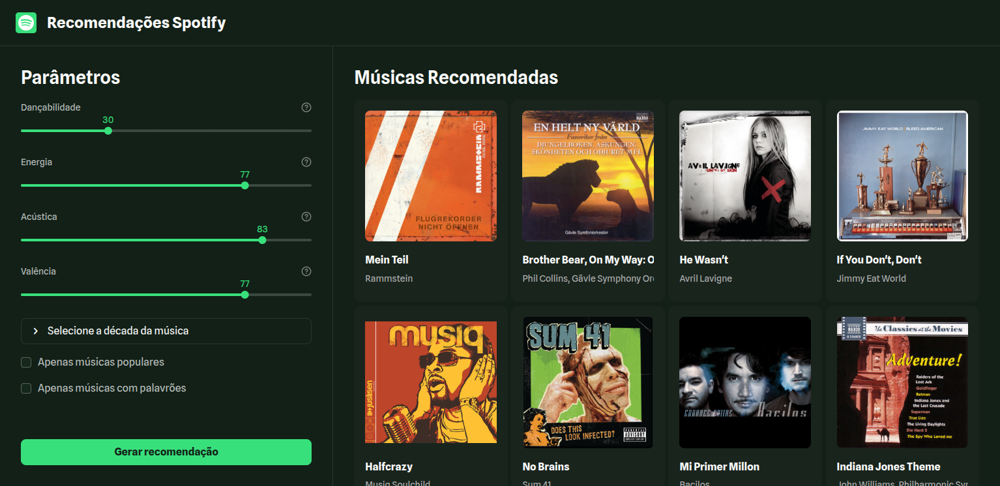

# Spotify Music Recommendation Frontend 🎵

Frontend responsivo de um sistema de recomendação de música baseado em IA, utilizando dados do Spotify e modelos K-Nearest Neighbors (KNN). Desenvolvido como parte do curso de pós-graduação da UNIRV.



## 🎯 Sobre o Projeto

Este é o **frontend** do sistema de recomendação Spotify. A aplicação fornece uma interface intuitiva e responsiva que permite aos usuários:

- 🎚️ Ajustar parâmetros de áudio (Dançabilidade, Energia, Acústica e Valência)
- 📅 Selecionar décadas específicas
- ✅ Filtrar por músicas populares ou com palavrões
- 🎵 Receber recomendações personalizadas de um dataset de **169.000+ músicas**
- 📱 Desfrutar de uma experiência otimizada para **mobile, tablet, desktop**

## ✨ Características Principais

### 🤖 Engine de Recomendação

- **Algoritmo**: K-Nearest Neighbors (KNN)
- **Features do Modelo**: 16 features bem balanceadas e distribuídas
- **Dataset**: 169.000+ músicas do Spotify
- **Normalização**: StandardScaler para normalização dos dados de entrada

## 📋 Pré-requisitos

- **Python 3.12+**
- **Git**
- **Pipenv** ou **venv** (gerenciamento de dependências)
- **Navegador moderno** (Chrome, Firefox, Safari, Edge)

## 🔧 Instalação

### 1. Clone o repositório

```bash
git clone https://github.com/Rhogger/spotify-music-recomendation-frontend.git
cd spotify-music-recomendation-frontend
```

### 2. Configure o ambiente virtual

#### Opção A: Usando Pipenv (Recomendado)

```bash
# Instale o Pipenv (se não tiver instalado)
pip install pipenv

# Instale as dependências
pipenv install

# Ative o ambiente virtual
pipenv shell
```

#### Opção B: Usando venv

```bash
# Crie o ambiente virtual
python -m venv venv

# Ative o ambiente virtual
# Linux/Mac:
source venv/bin/activate
# Windows:
venv\Scripts\activate

# Instale as dependências
pip install -r requirements.txt
```

### 3. Execute a aplicação

```bash
streamlit run src/main.py
```

A aplicação abrirá em `http://localhost:8501/`

## 📁 Estrutura do Projeto

```text
spotify-music-recomendation-frontend/
├── src/
│   ├── __init__.py
│   ├── main.py                 # Entry point da aplicação
│   │
│   ├── assets/
│   │   ├── datasets/
│   │   │   ├── features.csv              # Features das músicas
│   │   │   └── pre_processing.csv        # Dados pré-processados
│   │   ├── icons/
│   │   │   └── spotify-tile.svg          # Logo do Spotify
│   │   └── models/
│   │       ├── music_model_features.pkl  # Lista de features do modelo
│   │       ├── music_recommender_model.joblib  # Modelo KNN treinado
│   │       └── scaler.joblib            # StandardScaler para normalização
│   │
│   ├── core/
│   │   ├── __init__.py
│   │   ├── model_loader.py     # Carregamento singleton dos modelos
│   │   └── recommender.py      # Lógica de recomendação (KNN)
│   │
│   ├── services/
│   │   ├── __init__.py
│   │   ├── spotify_api.py      # Integração com API Spotify
│   │   └── token_manager.py    # Gerenciamento de tokens
│   │
│   ├── ui/
│   │   ├── __init__.py
│   │   ├── components.py       # Componentes Streamlit reutilizáveis
│       ├── layout.py          # Layout principal da aplicação
│       └── styles.py          # Estilos CSS e media queries
│
├── .vscode/                    # Configurações do VS Code
├── .gitattributes             # Configuração para diffs do Git
├── .gitignore                 # Arquivos ignorados pelo Git
├── Pipfile                    # Dependências do projeto
├── Pipfile.lock              # Lock das dependências
├── requirements.txt          # Dependências (alternativa ao Pipfile)
├── ruff.toml                # Configuração do Ruff (linter)
├── DEV.md                   # Guia de desenvolvimento
└── README.md                # Este arquivo
```

## 👨‍💻 Desenvolvimento

Para mais detalhes sobre o setup de desenvolvimento, configuração do workspace e extensões recomendadas, consulte o documento [DEV.md](./DEV.md).

Lá você encontrará:

- **Configurações do Workspace** - Setup recomendado para VS Code com extensões essenciais para Python, Jupyter notebooks e análise de dados
- **Extensões Recomendadas** - Lista curada de extensões para melhorar sua produtividade (Pylance, Jupyter, Python, etc.)
- **Padrões de Código** - Guia de estilo e formatação usando Ruff

## ✨ Tecnologias Utilizadas

- **Streamlit 1.28+** - Framework web Python
- **HTML/CSS** - Estilos customizados
- **JavaScript** - Detecção de overflow de texto
- **Python 3.12** - Linguagem principal
- **Pandas** - Manipulação de dados
- **NumPy** - Computação científica
- **Scikit-learn** - Modelo KNN e StandardScaler
- **Joblib** - Serialização de modelos
- **Ruff** - Linting e formatação
- **Git** - Controle de versão

## 🚀 Como Usar

### Interface Principal

1. **Parâmetros de Áudio** (coluna esquerda)
   - Ajuste 4 sliders (0-100): Dançabilidade, Energia, Acústica, Valência
   - Expanda o seletor de década para escolher um período
   - Marque as checkboxes para filtrar por popularidade e conteúdo explícito

2. **Recomendações** (coluna direita)
   - Clique em "Gerar recomendação"
   - Veja as músicas recomendadas com capas de álbum
   - Nomes e artistas com texto corrido para nomes longos (em mobile e tablet)
   - Clique em um card para abrir no Spotify (quando disponível)

### Exemplos de Busca

```markdown
🎵 Música animada: Dançabilidade 80, Energia 90, Acústica 20, Valência 80
🎸 Música acústica: Dançabilidade 40, Energia 50, Acústica 90, Valência 60
😢 Música melancólica: Dançabilidade 30, Energia 30, Acústica 70, Valência 20
🎸 Rock energético: Dançabilidade 70, Energia 85, Acústica 20, Valência 70
```

## 📄 Licença

Este projeto está sob a licença MIT. Veja o arquivo `LICENSE` para mais detalhes.
